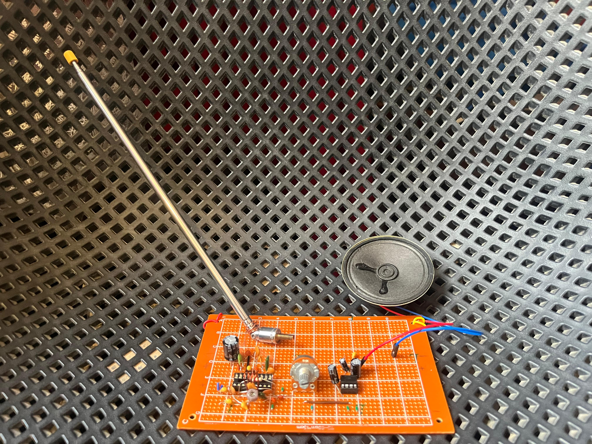
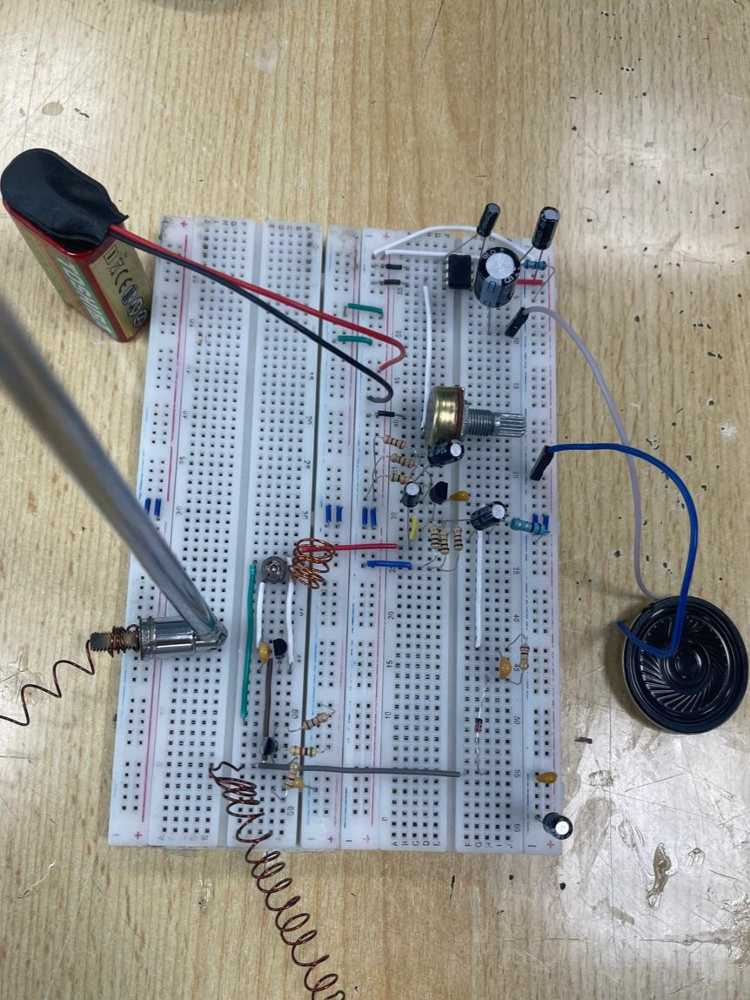
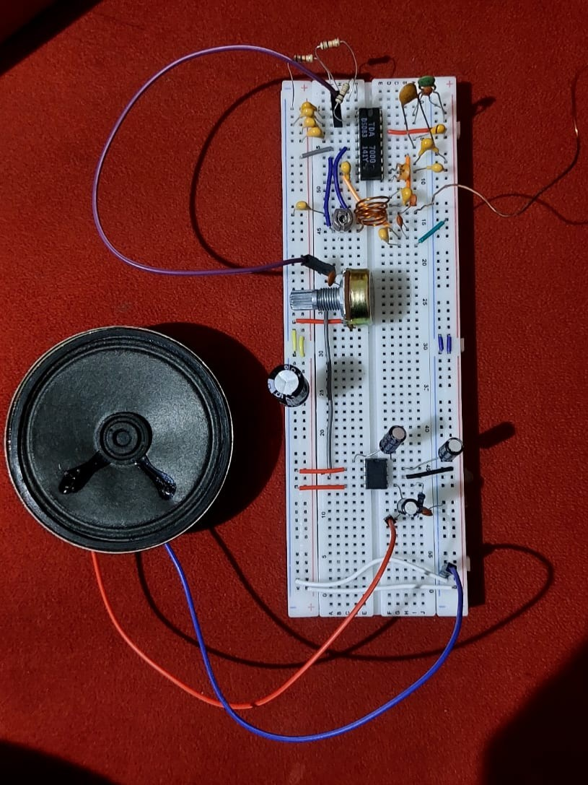
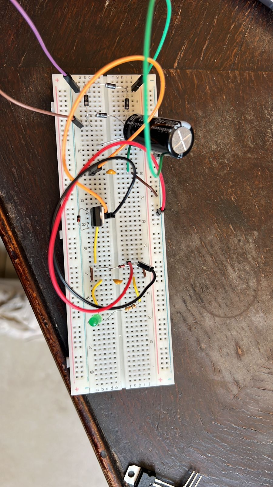
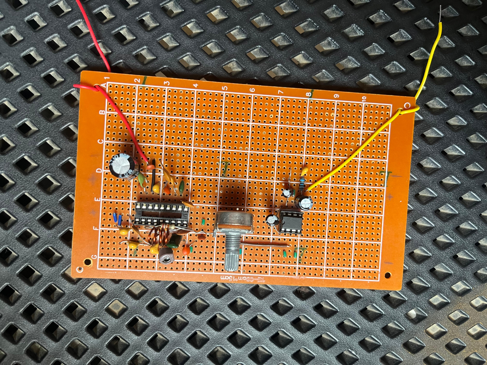
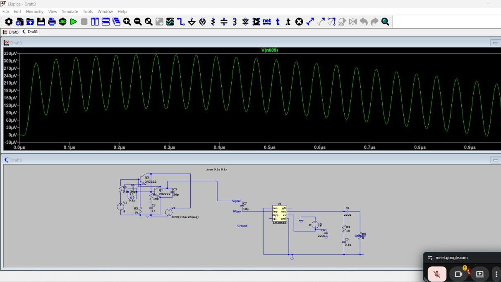
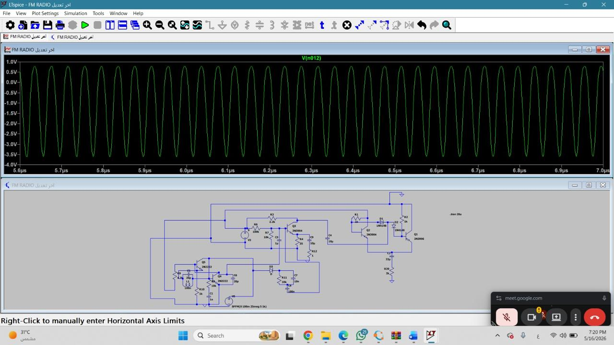
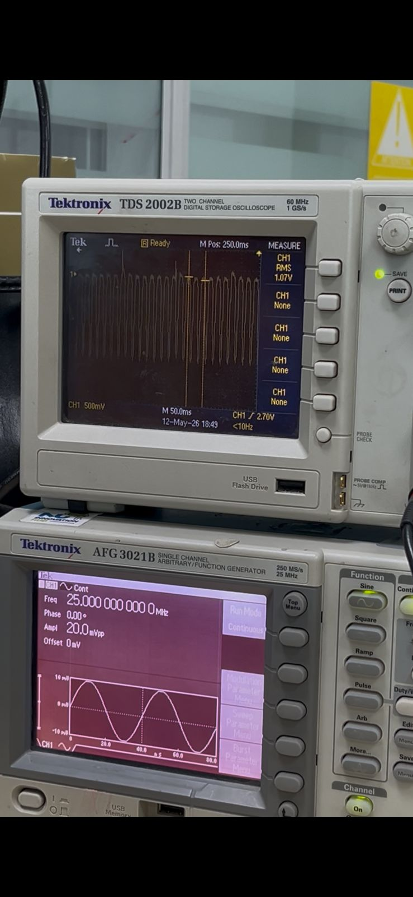

<p align="center">

</p>

<h1 align="center">
📻 FM Radio Receiver with Audio Amplification System
</h1>

<p align="center">
An analog FM radio receiver designed, simulated, and implemented using discrete electronic components. The project demonstrates RF tuning, FM demodulation, audio amplification, and practical hardware implementation using both Breadboard and PCB.
</p>

<p align="center">


</p>

---

# 📖 Overview

This project presents the complete design, simulation, implementation, and testing of an **Analog FM Radio Receiver** capable of receiving commercial FM radio stations within the **88–108 MHz** frequency band.

The receiver consists of an RF reception stage, an LC resonant tuning circuit for station selection, an FM demodulation stage, an audio amplifier, a regulated power supply, and an 8Ω loudspeaker.

The amplifier stage was first verified using **LTspice** to evaluate circuit behavior before hardware implementation. After simulation, the complete receiver was assembled, tested, debugged, and validated using both **Breadboard** and **PCB** implementations.

---

# ✨ Key Features

- 📡 FM Broadcast Reception (88–108 MHz)
- 🎚 Manual Frequency Tuning
- 📻 FM Signal Demodulation
- 🔊 Audio Amplification
- 🔈 8Ω Speaker Output
- 🧪 LTspice Simulation
- 🛠 Breadboard Prototype
- 💻 PCB Implementation
- 📈 Oscilloscope Verification
- 🔋 Battery Powered

---

# 🏗 System Architecture

```text
              Antenna
                 │
                 ▼
         RF Receiver Stage
                 │
                 ▼
        LC Tuning Circuit
                 │
                 ▼
      FM Demodulation Stage
                 │
                 ▼
      Audio Amplifier Stage
                 │
                 ▼
            8Ω Speaker
```

---
# 📸 Hardware Gallery

The following images show the complete hardware implementation throughout different development stages, including breadboard prototyping, amplifier testing, power supply construction, and final PCB assembly.

<table>
<tr>

<td align="center">

<b>Breadboard Implementation</b><br><br>



</td>

<td align="center">

<b>Audio Amplifier</b><br><br>



</td>

<td align="center">

<b>Power Supply</b><br><br>



</td>

</tr>

</table>

<br>

<p align="center">

<b>PCB Implementation</b><br><br>



</p>

---

# 🧪 LTspice Simulation

Before constructing the hardware, the amplifier stage was simulated using **LTspice** to verify circuit operation, evaluate the output waveform, and minimize implementation errors.

<table>

<tr>

<td align="center">

<b>Amplifier Circuit</b><br><br>



</td>

<td align="center">

<b>Output Waveform</b><br><br>



</td>

</tr>

</table>

The simulation results closely matched the practical implementation, providing confidence before assembling the physical circuit.

---

# 📊 Testing & Results

The completed receiver was experimentally tested after assembly to evaluate its functionality and overall performance.

<p align="center">

<b>Oscilloscope Output</b><br><br>



</p>

The validation process included:

- ✅ RF signal reception
- ✅ Manual station tuning
- ✅ Audio output verification
- ✅ Oscilloscope measurements
- ✅ Hardware debugging
- ✅ Noise reduction
- ✅ Power supply validation

---
# 🔩 Main Hardware Components

The table below summarizes the main hardware components used in the implementation and their corresponding functions.

| Component | Function |
|-----------|----------|
| Antenna | Receives FM broadcast signals |
| LC Tank Circuit | Selects the desired FM station by resonance |
| Variable Capacitor | Allows manual frequency tuning |
| Audio Amplifier | Amplifies the recovered audio signal |
| 8Ω Speaker | Produces the audio output |
| Voltage Regulator | Provides a stable DC supply voltage |
| Battery | Powers the complete system |

---

# 🚀 Development Workflow

The project followed a systematic engineering workflow from research to final testing.

```text
Research & Literature Review
            │
            ▼
Component Selection
            │
            ▼
Circuit Design
            │
            ▼
LTspice Simulation
            │
            ▼
Breadboard Assembly
            │
            ▼
Circuit Debugging
            │
            ▼
PCB Implementation
            │
            ▼
System Testing
            │
            ▼
Performance Evaluation
```

---

# ⚠ Challenges

During the implementation, several practical engineering challenges were encountered. These issues required repeated testing, measurements, and hardware optimization before achieving stable circuit operation.

- RF tuning sensitivity
- Signal instability
- Breadboard parasitic effects
- Grounding and noise issues
- Component tolerance variations
- Coil optimization
- Hardware debugging and troubleshooting

Each challenge was addressed through iterative simulation, practical testing, component replacement, and circuit optimization.

---

# 💡 Skills Demonstrated

This project strengthened both theoretical understanding and practical engineering experience in the following areas:

- Analog Electronics
- RF Communication Fundamentals
- Electronic Circuit Design
- Audio Amplifier Design
- LTspice Circuit Simulation
- Breadboard Prototyping
- PCB Assembly
- Oscilloscope Measurements
- Hardware Testing
- Circuit Debugging
- Engineering Problem Solving

---
# 📈 Future Improvements

Although the project successfully demonstrates the operation of an analog FM receiver, several enhancements can further improve its performance and functionality.

- Improve receiver sensitivity.
- Enhance audio output quality.
- Design a compact custom PCB.
- Add automatic station tuning.
- Integrate stereo FM decoding.
- Improve antenna matching.
- Reduce circuit noise and interference.

These improvements would increase both the reliability and the overall user experience of the receiver.

---

# 🎥 Project Demonstration

The following video demonstrates the complete hardware implementation, testing process, and practical operation of the FM Radio Receiver.

<p align="center">

<a href="https://drive.google.com/file/d/1h2xnaICsLna61kK0NpyrLvJ_sNMtKfjN/view?usp=drive_link">


</a>

</p>

---

# 📁 Repository Structure

```text
FM-Radio-Receiver
│
├── Images
│   ├── final-project.jpeg
│   ├── breadboard-implementation.jpeg
│   ├── pcb-implementation.jpeg
│   ├── class-ab-amplifier.jpeg
│   ├── power-supply.jpeg
│   ├── oscilloscope-output.jpeg
│   ├── ltspice-amplifier.jpeg
│   └── ltspice-output.jpeg
│
├── Simulation
│   ├── FM_Receiver.asc
│   ├── Amplifier.asc
│   └── LTspice Screenshots
│
├── Project_Report.pdf
├── README.md
└── LICENSE
```

---

# 📚 References

- LTspice Simulation Software
- Electronic Circuits II Course Material
- Semiconductor & Component Datasheets
- Analog FM Receiver Design References

---
# 👨‍💻 Author

<div align="center">

## Ahmed Samir

**Computer Systems Engineering Student**

Faculty of Engineering and Applied Sciences

Nile University

Passionate about **Embedded Systems**, **Electronics**, **IoT**, and **Analog Circuit Design**.

[](https://github.com/AhmedSamirNU)

<!-- Replace with your LinkedIn profile if available -->
<!--
[](YOUR_LINKEDIN_LINK)
-->

</div>

---

# 🙏 Acknowledgment

This project was completed as part of the **Electronic Circuits II** course. It represents a complete engineering workflow starting from circuit analysis and simulation, followed by hardware implementation, testing, debugging, and performance evaluation.

The experience significantly strengthened our practical understanding of analog electronics, RF communication, circuit simulation, PCB implementation, and engineering problem solving.

---

<div align="center">

### ⭐ If you found this project interesting, consider giving it a Star!

Your support is greatly appreciated.

</div>

<p align="center">

Made with ❤️ by Ahmed Samir

</p>
